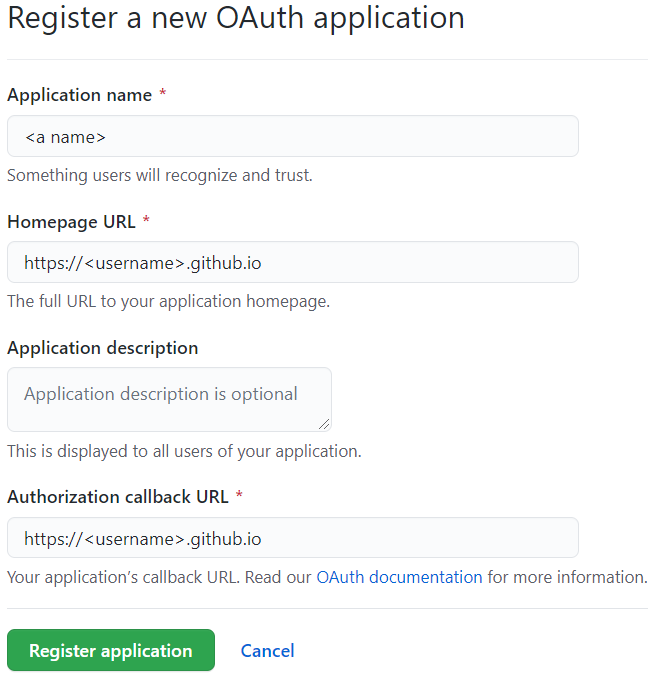
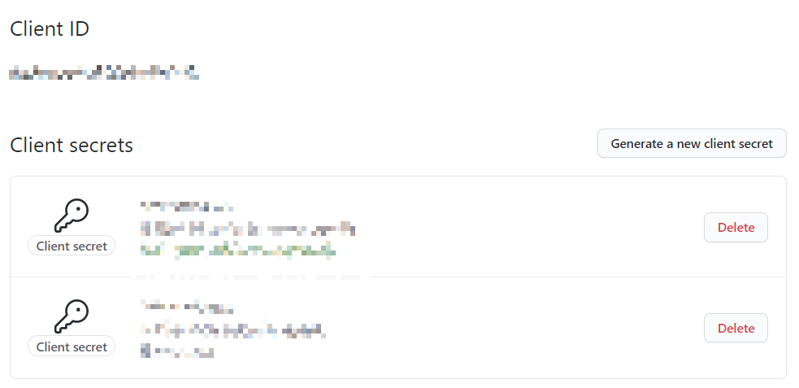

在  中我们配置了 `hexo+NexT` 的博客, 这次来给它添加一个评论区. 使用的是 [gitalk](https://github.com/gitalk/gitalk). 

<!-- more -->

**注意** 该方法可能存在隐私问题, 详见 [V2EX 论坛](https://www.v2ex.com/t/535608). 

在 `hexotest/` 文件夹下使用

```bash
npm i --save gitalk
```
来安装 `gitalk`, 而且 `NexT8` 内置了 `gitalk` 的接口, 在 `_config.next.yml` 中搜索 `gitalk` 即可看到

```yml
# Multiple Comment System Support
comments:
  # Available values: tabs | buttons
  style: tabs
  # Choose a comment system to be displayed by default.
  # Available values: disqus | disqusjs | changyan | livere | gitalk | utterances
  active:
  # Setting `true` means remembering the comment system selected by the visitor.
  storage: true
  # Lazyload all comment systems.
  lazyload: false
  # Modify texts or order for any navs, here are some examples.
  nav:
    #disqus:
    #  text: Load Disqus
    #  order: -1
    #gitalk:
    #  order: -2
# Gitalk
# For more information: https://gitalk.github.io
gitalk:
  enable: false
  github_id: # GitHub repo owner
  repo: # Repository name to store issues
  client_id: # GitHub Application Client ID
  client_secret: # GitHub Application Client Secret
  admin_user: # GitHub repo owner and collaborators, only these guys can initialize gitHub issues
  distraction_free_mode: true # Facebook-like distraction free mode
  # When the official proxy is not available, you can change it to your own proxy address
  proxy: https://cors-anywhere.herokuapp.com/https://github.com/login/oauth/access_token # This is official proxy adress
  # Gitalk's display language depends on user's browser or system environment
  # If you want everyone visiting your site to see a uniform language, you can set a force language value
  # Available values: en | es-ES | fr | ru | zh-CN | zh-TW
  language:
  ```
这里做一下简单的说明. 

首先要在 [github devoloper](https://github.com/settings/developers) 创建新的 OAuth App

点击创建好的 OAuth App, 可以看到

点击 `Generate a new client secret` 可以得到一个 `client secret`. 把 `client ID` 与 `client secret` 分别填写在 `yml` 文件的 `client_id` 与 `client_secret` 字段中, 剩下的字段填自己的信息以及用来存放评论的 repo, 这里我填的 `<username>.github.io`. 配置好以后, 使用
```bash
hexo clean && hexo g -d
```
进行在线部署, 随便选一篇博文, 在最下方登录一下 `github` 完成初始化. 

但是遇到了问题. 
```
Error: Request failed with status code 403
```
经查询发现这个问题普遍存在, 比如微信文章 [记录一次 Bug 排查过程并分享一些经验](https://mp.weixin.qq.com/s?__biz=Mzg3MjU3NzU1OA==&mid=2247496606&idx=1&sn=8e0b6e2600f939c5401f2344dce2cba6&source=41#wechat_redirect), [gitalk's issue](https://github.com/gitalk/gitalk/issues/429). 作者也给了相应的[解决方法](https://github.com/gitalk/gitalk/issues/429#issuecomment-789423631)

我这里将 `proxy` 替换为了
```yml
proxy: https://cors-anywhere.azm.workers.dev/https://github.com/login/oauth/access_token
```
再次 `hexo clean && hexo g -d`, 即可使用 `gitalk`, 评论区会作为设置中的 `repo` 的 `issue` 存在. 