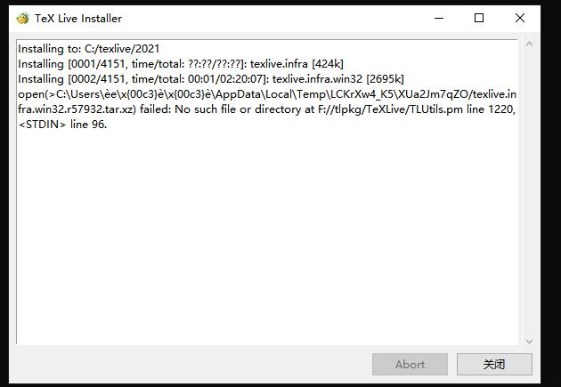
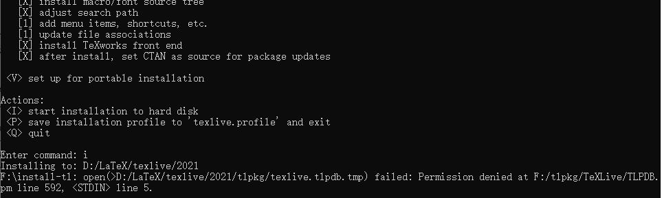

在 Windows 上安装 TeX Live 时可能遇到由于缓存路径名称不合法, 即 **不是纯英文的无空格的路径**, 而安装错误的情况. 

<!-- more -->
### 错误
在使用 GUI 界面安装时, 出现的错误形如下图



命令行安装时错误如下图



### 原因

这是因为 TeX Live 安装的时候需要使用环境变量 `TEMP` 与 `TMP` 来释放临时文件, 但是路径名不合法会导致调用失败. 

### 解决方法

1. 永久修改 `TEMP` 与 `TMP` 环境变量的值. 知道了问题在哪就容易解决了, 首先 `右键此电脑→属性→高级系统设置→环境变量→用户环境变量` 找到 `TEMP` 与 `TMP`, 如果没有刻意设置的话其值应该都为
```
%USERPROFILE%\AppData\Local\Temp
```
中文用户名便会导致 `%USERPROFILE%` 中含有无法识别的中文字符, 我们可以修改这个路径改为合法路径, 如
```
C:/Temp
```
再启动安装程序即可安装成功. 

2. 临时修改 `TEMP` 与 `TMP` 环境变量的值. 在 `cmd` 中执行
```bash
mkdir C:\temp
set TEMP=C:\temp
set TMP=C:\temp
```
即可临时修改这两个环境变量的值, 然后继续在 `cmd` 中执行安装程序即可. 关闭 `cmd` 窗口时这两个环境变量将恢复为原始状态. 

### 后续

但是中文用户名带来的问题不仅仅是安装 TeX Live 失败. 所以最好可以拥有一个英文无空格的用户名, 首先最推荐的就是重装系统, 重新设置用户名. 如果无法或不愿重装系统, 可以尝试修改用户名, 但是**直接修改用户名可能会导致严重的后果, 操作之前要做好数据备份以及心理准备**, 下面放上可供参考的修改方法及知乎上的问题：

[可供参考的方法](http://www.xitongtiandi.net/wenzhang/win10/15351.html)

[知乎上的问题](https://www.zhihu.com/question/37082172)

[微软社区的技术支持1](https://answers.microsoft.com/zh-hans/windows/forum/windows_10-other_settings/win10%E5%AE%B6%E5%BA%AD%E7%89%88%E5%A6%82%E4%BD%95/26e8cc30-97e4-434d-9d11-406b3d25e0d1)

[微软社区的技术支持2](https://answers.microsoft.com/zh-hans/windows/forum/windows_10-security/win10%E5%A6%82%E4%BD%95%E8%83%BD%E5%A4%9F%E5%BD%BB/681b5ea9-7ba6-4860-bc9c-a3f59a2ee269)