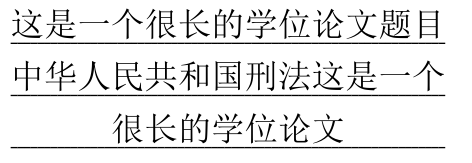
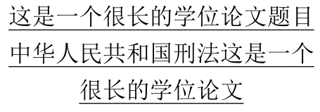
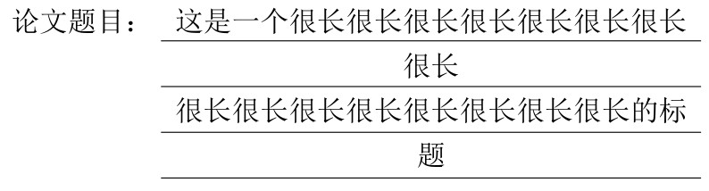
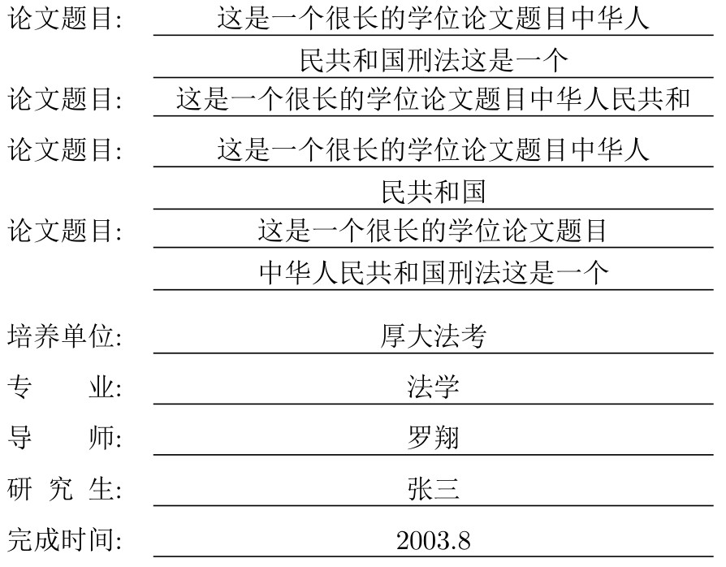

这篇文章的需求来源为 [LaTeX 问答站](https://ask.latexstudio.net/ask/question/3650.html) 的一个问题, 经观察也是普遍遇到的模板设计者的问题. 主要需要达到下图的设计效果:



<!-- more -->
### 设计难点
可以看到设计难点有

1. 标题长度不固定, 可能需要自动换行
2. 需要将定长的下划线全范围覆盖
3. (可选) 需要照顾到用户对自动换行点不满意, 而进行的手动换行
4. (可选) 由于单行标题与多行标题的视觉效果不同, 也避免第二行只有少量文字而造成的“不好的”观感进行额外的调整

### 尝试实现

这个问题要使用的基础工具肯定是**表格**, 因为除了标题还会有其他的文字同时需要对齐

#### 格线作为下划线

我在探究的过程中首先想使用定宽表格 + 下格线来实现这一点很快我就否定了这个想法, 因为

1. 定宽表格内部的换行无法添加下格线作为“下划线”
2. (次要) 定宽表格只能机械地自动换行, 无法手动换行

#### `\CJKunderline` 自动处理
否定了这个想法之后继续探究, 我想到了可以使用 `\CJKunderline` 命令[^CJKunderline], 因为该下划线可以自动处理中文的换行, 把它应用在 `\parbox` 中进行一个嵌套应该可以

```latex
\documentclass{ctexart}
\usepackage{xeCJKfntef}
\begin{document}
    \parbox{13\ccwd}{\centering\CJKunderline{这是一个很长的学位论文题目中华人民共和国刑法这是一个很长的学位论文}}
\end{document}
```


问题又出现了, 它无法将最后一行的下划线进行填充. 虽然可以在文本的末尾添加 `\hfill` 来延长下划线, 但是不居中了.

### 最离谱的分割字符串

接下来我想通过分割标题字符串, 然后对每一行的字符串单独使用下划线, 毕竟对于确定的字符串的操作就随意了, 然后再将它们套入 `\parbox` 就 ok 了, 然后我找到了 [`xstring`](https://ctan.org/pkg/xstring) 宏包来对标题进行长度记数与分隔, 然后我将这个想法在 [TeX.SE](https://tex.stackexchange.com/questions/609378/cut-string-into-pieces) 进行了提问, 下面简单叙述一下

1. 使用 `\StrLen` 命令来确定标题的长度 `n`
2. 每行假定可放置 13 个字符, 那么就通过 [`xfp`](https://ctan.org/pkg/xfp) 提供的计算命令 `\fpeval` 计算标题被分隔的块数 `p = n/13` 
3. 然后通过 [`tikz-pgf`](https://www.ctan.org/pkg/pgf) 宏集提供的 `\foreach`命令来对块数 `p` 进行循环, 从而使每一行都具有定长的下划线而且居中

但是在 `\fpeval` 计算的步骤就直接寄了, 会报
```
! You can't use `\let' after \the.
<argument> \let

l.5     \fpeval{\StrLen{\abc}/5}

?
```

### 可实现的方法

#### `adjustbox` 宏包

然后 QQ 群LaTeX技术交流 1 群 (91940767) 中的行者 (qq:957114619) 根据上述问题的 [回答](https://tex.stackexchange.com/a/609433/180617) 进行了整理, 发布到了 [LaTeXStudio](https://latexstudio.net/index/details/index/mid/1799.html). 这里进行一下备份

```latex
% 本文来源:https://tex.stackexchange.com/questions/609378/cut-string-into-pieces,LaTeX技术交流 2 群(qq群号：478023327) 的“乙醇”网友（qq号：914920345）提供来源


\documentclass[12pt]{article}
\usepackage{ctex}
\usepackage{geometry}
\geometry{a4paper,height=225mm,width=156mm}

\usepackage{adjustbox}

%\usepackage{lipsum}
\usepackage{xurl}
\usepackage{hyperref}
\begin{document}
\title{“固定列宽、内容居中、自动换行、且有下画线”效果的一种实现方法}
\author{zhangsming@foxmail.com}
\date{2021/08/04}
\maketitle

本文是 \LaTeX 工作室网站问答栏目“如何实现“固定列宽，自动换行且有下框线”问题（\url{https://ask.latexstudio.net/ask/question/3486.html}）的一种实现方法。

%\usepackage{adjustbox}
\newlength\myheight
\newcommand\Mysavedprevdepth{}%
\newcommand\UnderlineCentered[3]{%
  \begin{adjustbox}{minipage=[t]{\dimexpr#1\relax},gstore totalheight=\myheight,margin=0pt}%
    \centering\leavevmode#3\par\xdef\Mysavedprevdepth{\the\prevdepth}%
  \end{adjustbox}%
  \hspace*{-\dimexpr#1\relax}%
  \begin{adjustbox}{minipage=[t][\myheight]{\dimexpr#1\relax},margin=0pt}%
    \vphantom{Eg}\lower\dimexpr#2\relax\hbox to\hsize{\leaders\hrule\hfill\kern0pt}\par
    \kern-\dimexpr#2\relax
    \xleaders\vbox to\baselineskip {\vfill\hbox{\lower\dimexpr#2\relax\hbox to\hsize{\leaders\hrule\hfill\kern0pt}}\kern-\dimexpr#2\relax}\vfill
    \kern\Mysavedprevdepth
  \end{adjustbox}%
}%

本文的主体代码来源于 StackExchange 网站“Cut string into pieces”问题（\url{https://tex.stackexchange.com/questions/609378/cut-string-into-pieces}）名为“Ulrich Diez”用户的回答。

\bigskip

\begin{center}
  \begin{tabular}{rc}
    论文题目： & \UnderlineCentered{8cm}{1.5mm}{这是一个很长很长很长很长很长很长很长很长\\很长很长很长很长很长很长很长很长的标题}\\
  \end{tabular}
\end{center}

\bigskip

上列排版效果的代码使用了自定义的 UnderlineCentered 宏：

\bigskip

\verb|\UnderlineCentered{<文本宽度>}{<下画线深度>}{<文本内容>}|

\bigskip

其中，\verb|<文本宽度>| 和 \verb|<下画线深度>| 的取值均为长度。上例中的代码是：

\bigskip

\verb|\UnderlineCentered{8cm}{1.5mm}{这是一个很长...}|

\bigskip

\verb|\UnderlineCentered| 主要使用 \verb|adjustbox| 宏包提供的 \verb|adjustbox| 定义，具体实现方式请查看本文源代码。

\bigskip

致谢：感谢 LaTeX技术交流 2 群(qq群号：478023327) 的“哈尔滨 - 乙醇”网友（qq号：914920345）提供代码来源。

\end{document}
```
截取部分实现效果为


可见, 该方法支持自动换行及手动换行, 满足了需求 1, 2, 3, 但是再进行观察可以发现第 4 行只有一个“题”字, 美观度不足, 但是瑕不掩瑜, 任务完成. 

#### `\rule` 与文字分别排版

该方法来自于我的另一个 [Github](https://github.com/CTeX-org/forum/issues/208) 上问题, 其中 [慕子](https://github.com/muzimuzhi) 回答

> 知乎文章《[双语标题：LaTeX 实现](https://zhuanlan.zhihu.com/p/51494365)》 里有一个实现

这个文章也是他写的, 可以完美实现我们的需求, 除了代码有点长（

```latex
\documentclass{ctexart}
\usepackage{calc}
\makeatletter
\renewcommand{\arraystretch}{1.2}

% inner temp length
\newlength\@tempTitleHt
\newlength\@tempTitleMaxWd

% length used as parameters， "Wd" is a shorthand for "Width"
\newlength\titleSingleLineMaxWd
\newlength\titleMultiLineMaxWd
\newlength\titleLRExtraWd
\newlength\titleSepWd

\setlength\titleSingleLineMaxWd{0.6\textwidth}
\setlength\titleMultiLineMaxWd{0.5\textwidth}
\setlength\titleLRExtraWd{.5em}
\setlength\titleSepWd{.5em}

% main macro, using a simple table
% \newcommand{\multilingualTitles}[2]{%
%   \par
%   {\noindent\centering
%   \begin{tabular}{r @{\hspace{\titleSepWd}} p{\titleSingleLineMaxWd}}
%   	中文标题           & \titleBox{#1} \\
%   	                 &               \\[-10pt]
%   	Title in English & \titleBox{#2}
%   \end{tabular}\par}%
% }

% draw a fixed-width underline
\newcommand{\titleUnderline}{%
  \rule[-.3em]{\titleSingleLineMaxWd + 2\titleLRExtraWd}{.5pt}}

% title content typesetter
\newcommand\titleBox[1]{%
  \setlength\@tempTitleMaxWd\titleSingleLineMaxWd
  % Measure the total height of #1 subject to \titleSingleLineMaxWd.
  % Here \@titleBox is necessary when #1 contains "\\".
  \settototalheight\@tempTitleHt{\@titleBox{#1}}%
  \ifdim\@tempTitleHt=0pt%
    % case 1: #1 causes empty output
    \titleUnderline
  \else
    % Change to LR mode, for inserting a zero-width box right after.
    \leavevmode
    % note: Use \normalbaseineskip instead of \baselineskip, 
    %       since the latter is set to 0pt inside tabular env.
    \ifdim\@tempTitleHt>\normalbaselineskip
      % case 2: #1 is fit for multilines, or contains `\\`, hence
      %         \titleMultiLineMaxWd is used instead, and the total 
      %         height of #1 subject to new max width is re-measured.
      \setlength\@tempTitleMaxWd\titleMultiLineMaxWd
      \settototalheight\@tempTitleHt{\@titleBox{#1}}%
      % \rlap{\smash{...}} typesets content of its argument normally 
      % but sets it into a zero sized box. Here \@titleBox set 
      % (possiblly) multi-line text into a single box, since \smash 
      % only takes in argument spreading one line.
      %
      % Every line of title content needs an underline, hense we do
      % a loop to typeset one underline for every line the title 
      % content actually spreads.
      \rlap{\smash{\@titleBox{%
        \@whiledim\@tempTitleHt>0pt%
        \leavevmode
        % 
        \do{%
          \rlap{\titleUnderline}\\%
          \addtolength\@tempTitleHt{-\normalbaselineskip}%
        }%
      }}}%
      % Insert h-offset to manually center the title content.
      \hspace{\dimexpr\titleLRExtraWd + .5\titleSingleLineMaxWd - .5\titleMultiLineMaxWd\relax}%
      \@titleBox{\centering #1}%
    \else
      % case 3: #1 is fit for one line
      \rlap{\titleUnderline}%
      \hspace{\titleLRExtraWd}%
      \@titleBox{\centering #1}%
    \fi
  \fi
}

% common operations on every title content
\newcommand{\@titleBox}[1]{%
  \parbox[t]{\@tempTitleMaxWd}{#1}}
\makeatother
\newlength{\lwtm}
\setlength{\lwtm}{\widthof{论文题目 :}}
\begin{document}
\begin{tabular}{p{\lwtm} p{\titleSingleLineMaxWd}}
    \makebox[\lwtm][s]{论文题目 :}           & \titleBox{这是一个很长的学位论文题目中华人民共和国刑法这是一个} \\
    \makebox[\lwtm][s]{论文题目 :}           & \titleBox{这是一个很长的学位论文题目中华人民共和} \\
    \makebox[\lwtm][s]{论文题目 :}           & \titleBox{这是一个很长的学位论文题目中华人民共和国} \\
    \makebox[\lwtm][s]{论文题目 :}           & \titleBox{这是一个很长的学位论文题目\\中华人民共和国刑法这是一个} \\
                                            &               \\[-10pt] % 用于分隔题目与其他信息
    \makebox[\lwtm][s]{培养单位 :}           &    \titleBox{厚大法考}          \\
    \makebox[\lwtm][s]{专业 :}               &   \titleBox{法学}\\
    \makebox[\lwtm][s]{导师 :}               &   \titleBox{罗翔} \\
    \makebox[\lwtm][s]{研究生 :}              &  \titleBox{张三} \\
    \makebox[\lwtm][s]{完成时间 :}            &  \titleBox{2003.8} \\
\end{tabular}
\end{document}
```
该代码中含有大量的注释, 使我能在很短的时间内 (指一上午) 读完代码并且了解操作原理, 下面是实现效果


可以看到, 第二个“论文题目”中单行中的文字比多第三个中的多行文字只少了一个“国”字但是它可以自动换行并且制造一个良好的视觉效果, 代码的关键在于

```latex
% 设定不同的单行与多行的最大行长度
\newlength\titleSingleLineMaxWd
\newlength\titleMultiLineMaxWd
...
\setlength\titleSingleLineMaxWd{0.6\textwidth}
\setlength\titleMultiLineMaxWd{0.5\textwidth}
...
% 将文本内容放入单行长度相当的 \parbox 中, 
% 判断其能否用单行进行排版, 
% 如果不能, 将使用多行的最大行长相当的 \parbox 进行排版, 
% 这样就不会出现第二行之后 1 个或 2 个字的情况
\newcommand{\@titleBox}[1]{%
  \parbox[t]{\@tempTitleMaxWd}{#1}}
```

### 任务完成
先放松一下, 有更好的方法可以评论, 我会进行补充. 

[^CJKunderline]: 该命令由宏集 [`xeCJK`](https://ctan.org/pkg/xecjk) 中宏包 `xeCJKfnt` 提供 