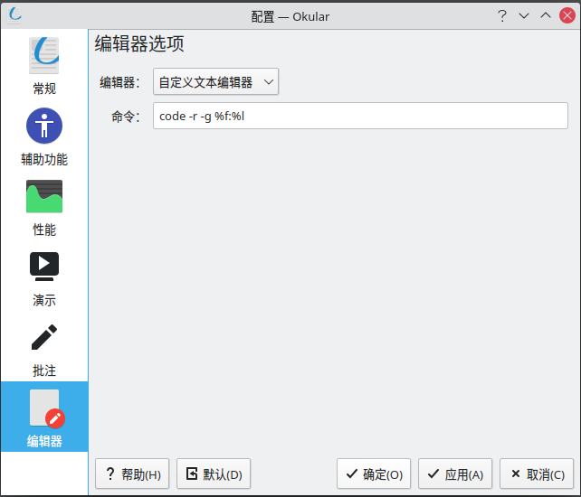

手贱小白还愿意折腾. 自从上次重装系统之后, Ubuntu 总时不时地卡顿, 一气之下试了好几个发型版, 如 [manjaro](https://manjaro.org/), [deepin](https://www.deepin.org/zh/) (我是没想到 deepin 的卡顿竟然是永久性的, 也许是我空间分配不合理吧), [debian](https://www.debian.org/index.zh-cn.html) (这个体验还蛮好的), 最终一狠心, 要折腾不如折腾大的, 直接 [Arch Linux](https://archlinux.org/) 走起.

<!-- more -->

从介绍来看 Arch Linux 最吸引我的有两点, 一个是 [AUR 仓库](https://aur.archlinux.org/), 另一个是 [Arch Wiki](https://wiki.archlinux.org/), 前者提供了海量用户打包好的软件, 后者提供了海量的说明文档.

***以下内容如没有特殊说明, 均在普通用户下操作, 即终端起始为 `$` 时***

### 双系统安装
双系统安装可以看[这篇知乎](https://zhuanlan.zhihu.com/p/138951848), 我选择的桌面环境是 KDE Plasma, 默认环境下就很好看


安装后在系统设置中将语言与地区改为中文, 在改 Region 的时候注意是 `zh-CN`, 不要改成蒙古语 `mn_CN`.

### 软件的安装与配置
#### 安装重要组件 `yay`

```bash
sudo pacman -S yay
```

简单说一下 `yay`: Arch Linux 除了官方的软件库以外, 还提供了一个允许用户上传软件包的仓库, [AUR 仓库](https://aur.archlinux.org/), 你可以在上面找到几乎任何你想要安装的软件, ~~甚至基于 `deepin-wine` 的 qq 和微信~~(这个在我的计算机上出现了问题, QQ 的问题见[该issue](https://github.com/countstarlight/deepin-wine-qq-arch/issues/58), 微信的问题为严重卡顿), Arch Linux 官方的包管理软件为 `pacman`, AUR 仓库的管理软件则为 `yay`. 

#### 我的常用软件, 

一些软件可以在 Arch Wiki 上找到它们的不同版本的对比信息, 一些软件的详细配置会在后文详述

##### 官方仓库

用 `sudo pacman -S <软件包>` 安装

1. [firefox](https://archlinux.org/packages/extra/x86_64/firefox/), Mozilla 出品的火狐浏览器, 使用体验不错
2. [flameshot](https://archlinux.org/packages/community/x86_64/flameshot/), 火焰截图, 一款截图/贴图软件, 使用方便
3. [fcitx](https://archlinux.org/packages/community/x86_64/fcitx/), 小企鹅输入框架, 这里我选了 v4 版本的, 没有用 fcitx5
4. [fcitx-rime](https://archlinux.org/packages/community/x86_64/fcitx-rime/), 中州韵输入法, 我常用的小鹤音形可以在该输入法上实现, 具体的其他输入方式可以看 [Fcitx (简体中文)](https://wiki.archlinux.org/title/Fcitx_(%E7%AE%80%E4%BD%93%E4%B8%AD%E6%96%87))
5.  [fcitx-qt5](https://archlinux.org/packages/community/x86_64/fcitx-qt5/), [kcm-fcitx](https://archlinux.org/packages/community/x86_64/kcm-fcitx/), [fcitx-configtool](https://archlinux.org/packages/community/x86_64/fcitx-configtool/), 分别为fcitx 提供对 Qt 提供的输入法模块, fcitx 的图形配置界面, fcitx 的配置工具
6. [zsh](https://archlinux.org/packages/extra/x86_64/zsh/), Z-Shell 终端, 有 `oh-my-zsh` 的配合, 配置起来相对容易
7. [~~screenfetch~~](https://archlinux.org/packages/community/any/screenfetch/), 在终端通过 `screenfetch` 命令来显示发型版的 logo 与信息, 该软件的 3.9.1 版本输出时会报 warning:
    ```
    /usr/bin/screenfetch:行1802: 7020826624-：语法错误: 需要操作数 (错误符号是 "-")
    ```
8. [neofetch](https://archlinux.org/packages/community/any/neofetch/), 与 screenfetch 相同的功能.
```
➜ neofetch
                   -`                    syvshc@archlinux 
                  .o+`                   ---------------- 
                 `ooo/                   OS: Arch Linux x86_64 
                `+oooo:                  Host: Inspiron 5577 1.1.3 
               `+oooooo:                 Kernel: 5.13.13-arch1-1 
               -+oooooo+:                Uptime: 4 hours, 1 min 
             `/:-:++oooo+:               Packages: 1493 (pacman) 
            `/++++/+++++++:              Shell: zsh 5.8 
           `/++++++++++++++:             Resolution: 1920x1080, 1920x1080 
          `/+++ooooooooooooo/`           DE: Plasma 5.22.5 
         ./ooosssso++osssssso+`          WM: KWin 
        .oossssso-````/ossssss+`         Theme: Breeze Light [Plasma], Breeze [GTK2/3] 
       -osssssso.      :ssssssso.        Icons: Papirus-Nordic [Plasma], Papirus-Nordic [GTK2/3] 
      :osssssss/        osssso+++.       Terminal: konsole 
     /ossssssss/        +ssssooo/-       CPU: Intel i5-7300HQ (4) @ 3.500GHz 
   `/ossssso+/:-        -:/+osssso+-     GPU: Intel HD Graphics 630 
  `+sso+:-`                 `.-/+oso:    GPU: NVIDIA GeForce GTX 1050 Mobile 
 `++:.                           `-/+/   Memory: 8548MiB / 15775MiB 
 .`                                 `/                                   
```
9. [steam](https://archlinux.org/packages/?name=steam), 需要在 `/etc/pacman.conf` 中开启 `multilib` 仓库, 并且需要安装一些图形驱动, 详见 [steam 的 Wiki](https://wiki.archlinux.org/title/Steam_(%E7%AE%80%E4%BD%93%E4%B8%AD%E6%96%87)), 如果开启 steam 后商店等界面均为黑屏幕, 不显示内容, 可以将 steam 的通道改为 `beta channel`, 具体问题见[关于 steam 黑屏的讨论](https://www.gamingonlinux.com/2021/09/steam-not-working-right-on-arch-linux-its-an-issue-with-freetype-and-theres-a-fix)

10. [obs-studio](https://archlinux.org/packages/community/x86_64/obs-studio/), 老牌屏幕录制软件

11. [vim](https://archlinux.org/packages/extra/x86_64/vim/), 文本编辑器, 正在学习

12. [man-pages-zh_cn](https://archlinux.org/packages/community/any/man-pages-zh_cn/), 中文帮助手册, 在终端用 `man <命令>` 来呼出

##### AUR 仓库

用 `yay -S <软件包>` 安装

1. [microsoft-edge-dev-bin](https://aur.archlinux.org/packages/microsoft-edge-dev-bin), 微软的新 edge, 由于我的插件与书签等都备份在了 Windows 的 edge 上, 这里我首选 edge, 如果没有这些包袱, 新的 FireFox 也是很好的选择
2. [visual-studio-code-bin](https://aur.archlinux.org/packages/visual-studio-code-bin/), 这里我选择了微软官方专用软件版本, 为了设置同步. 安装后可以直接在终端使用 `code <文件夹/文件>` 打开文件夹/文件
3. [telegram-desktop-bin](https://aur.archlinux.org/packages/telegram-desktop-bin/) 即时通讯软件 Telegram, 虽然我把它贴在这了, 但是由于无法下载部分组件, 我还是去了 [Telegram 的官网](https://desktop.telegram.org/)下载了 `AppImage`
4. [oh-my-zsh](https://aur.archlinux.org/packages/oh-my-zsh-git/), 对于 `zsh` 的美化, 提供了一些易用的接口
5. [listen1-desktop-appimage](https://aur.archlinux.org/packages/listen1-desktop-appimage/), Listen1, 集成了网易云音乐, QQ 音乐, 咪咕音乐的开源播放器, [QQ 音乐](https://aur.archlinux.org/packages/qqmusic-bin/)也有自己的包 
6. [deepin-wine-qq](https://aur.archlinux.org/packages/deepin-wine-qq/), 用 deepin-wine 实现的 windows qq, 这里只是列出, 我并没有使用
7. [deepin-wine-wechat](https://aur.archlinux.org/packages/deepin-wine-wechat/), 用 deepin-wine 实现的 windows wechat, 我同样没有使用

##### 手动安装

 1. [TeX Live 2021](http://tug.org/texlive/), 安装可以参考啸行的 [install-latex-guide-zh-cn](https://ctan.math.illinois.edu/info/install-latex-guide-zh-cn/install-latex-guide-zh-cn.pdf) 中的 `Ubuntu 20.04` 部分进行安装. 由于系统不同, 可以不在 `visudo` 中添加可信路径, 直接使用 `sudo tlmgr` 即可, 当然, Arch 官方仓库也打包了 [TeX Live](https://archlinux.org/packages/?sort=&q=texlive&maintainer=&flagged=). 使用文档见 [Arch Wiki](https://wiki.archlinux.org/title/TeX_Live_(%E7%AE%80%E4%BD%93%E4%B8%AD%E6%96%87)), 但是我没用明白, 又给卸了


##### 添加 `archlinuxcn` 源

国内的 Arch 组织也打包了一些软件, 我们将[`archlinuxcn`](https://github.com/archlinuxcn/repo#readme) 的源也添加到 `pacman` 的源

```bash
kate /etc/pacman.conf
```

在最下方添加 

```
[archlinuxcn]
Server = https://repo.archlinuxcn.org/$arch
```

用管理员权限保存后, 在终端运行

```
sudo pacman -Sy && sudo pacman -S archlinuxcn-keyring
```

来刷新仓库以及获取 PGP 钥匙串

我这里代理使用的是 [qv2ray](https://qv2ray.net/lang/zh/getting-started/step1.html#linux-arch-linux-%E6%88%96%E5%9F%BA%E4%BA%8E-arch-%E7%9A%84%E5%8F%91%E8%A1%8C%E7%89%88)+[v2core](https://github.com/v2fly/v2ray-core/releases), 由于某些原因, 直接看链接吧.

如果连接时出现类似
```
[Warning] failed to handler mux client connection > v2ray.com/core/proxy/vmess/outbound: connection ends > v2ray.com/core/proxy/vmess/outbound: failed to read header > v2ray.com/core/proxy/vmess/encoding: failed to read response header > websocket: close 1000 (normal)
```
的错误, 首先校对一下系统时间, 再进行连接.

#### 软件配置

这里会给出一些软件的配置, 使用的插件等等.

##### microsoft-edge

我使用的插件有
 * [AD Block](https://microsoftedge.microsoft.com/addons/detail/adblock-%E2%80%94-%E6%9C%80%E4%BD%B3%E5%B9%BF%E5%91%8A%E6%8B%A6%E6%88%AA%E5%B7%A5%E5%85%B7/ndcileolkflehcjpmjnfbnaibdcgglog) 广告拦截插件
 * [AD Block Plus](https://microsoftedge.microsoft.com/addons/detail/adblock-plus-%E5%85%8D%E8%B4%B9%E7%9A%84%E5%B9%BF%E5%91%8A%E6%8B%A6%E6%88%AA%E5%99%A8/gmgoamodcdcjnbaobigkjelfplakmdhh) 广告拦截插件
 * [Listen 1](https://microsoftedge.microsoft.com/addons/detail/listen-1/hneiglcmpeedblkmbndhfbeahcpjojjg) 与桌面版的 Listen 1 同样功能, 此为浏览器插件版本
 * [Office](https://microsoftedge.microsoft.com/addons/detail/office/gggmmkjegpiggikcnhidnjjhmicpibll) 在线的 Office 软件, 对于买了 Microsoft 365 的用户体验会有提升
 * [smartUp 手势](https://microsoftedge.microsoft.com/addons/detail/smartup%E6%89%8B%E5%8A%BF/elponhbfjjjihgeijofonnflefhcbckp) 鼠标手势插件
 * [Bilibili 助手](https://microsoftedge.microsoft.com/addons/detail/%E5%93%94%E5%93%A9%E5%93%94%E5%93%A9%E5%8A%A9%E6%89%8B%EF%BC%9Abilibilicom-%E7%BB%BC%E5%90%88%E8%BE%85%E5%8A%A9%E6%89%A9/fcfebhekhbkhjjimonjmbgmkbclheaoh) 提供 B 站的一些支持, 自动签到等
 * [沙拉查词](https://microsoftedge.microsoft.com/addons/detail/%E6%B2%99%E6%8B%89%E6%9F%A5%E8%AF%8D%E8%81%9A%E5%90%88%E8%AF%8D%E5%85%B8%E5%88%92%E8%AF%8D%E7%BF%BB%E8%AF%91/idghocbbahafpfhjnfhpbfbmpegphmmp) 词典插件, 支持划词查询, 集成了多家词典
 * [Absolute Enable Right Click & Copy](https://chrome.google.com/webstore/detail/absolute-enable-right-cli/jdocbkpgdakpekjlhemmfcncgdjeiika) 强制启用复制, 右键功能, 此为 Chrome 插件

##### vscode

1. 我使用的插件有
   * C/C++
   * Chinese (Simplified) Language Pack for Visual Studio Code: 中文语言包
   * Git History: 查看 git 历史的插件, 现在貌似有 vscode 官方的管理器了
   * Jupyter: vscode 中使用 jupyter notebook
   * LaTeX Workshop: LaTeX 用户必备插件
   * Local History: 本地保存的时候会生成一个副本, 可以回滚版本, 一般用不上, 用上了就救命
   * Markdown All in One: markdown 高亮等支持
   * Markdown Preview Enhanced: 更强的 md 渲染器
   * Material Icon Theme: 好看的图标包
   * One Dark Pro: 好看的主题
   * Pylance & Python: Python 用户插件
   * QQ: vscode 中使用 QQ
   * Terminal Here: 直接使 Terminal 定位在所打开的文件夹上
   * Cloudmusic: vscode 中使用网易云音乐
2. 这里是我的 [settings.json](https://gist.github.com/syvshc/999313a798d87a590b74ada95ec121ff) 的内容, 点击链接即可查看/下载, 其中有针对 Windows 用户以及 KDE/Okular 用户的 LaTeX 正反向搜索的内容[^1]. 
3. 如果登录账户的时候出现**将登陆信息写入钥匙串失败**的错误信息, 在终端运行
    ```bash
    yay -S qtkeychain gnome-keyring
    ```
    再重新在 vscode 中登录即可
    
##### Okular:
* 如果无法显示中文, 在终端运行 
  ```bash
  sudo pacman -S  poppler-data
  ```
  并重启 okular 即可.
* 使用 vscode 与 okular 进行 LaTeX 的正反向搜索, 在上述 `settings.json` 正确写入的基础上, 在 okular->设置->配置 Okular->编辑器 中, 选择自定义文本编辑器, 命令部分填写
  ```bash
  code -r -g %f:%l
  ```
  
  应用后, 在默认设置下, 在 vscode 中的 `.tex` 文件中同时按 `Ctrl+Alt+j` 会唤起 okular 到对应的位置, 在 okular 中激活"手型工具"的基础上, 按住 `Shift`, 同时鼠标左键点击 `PDF` 中的内容, 即可唤起 vscode 跳转到对应的源代码位置[^2].
##### zsh & oh-my-zsh
1. 我使用的插件:
    * [git](https://github.com/ohmyzsh/ohmyzsh/tree/master/plugins/git#readme): oh-my-zsh 自带插件, 直接填入 plugin 即可使用, 提供了一些 `git` 的 alias
    * [z](https://github.com/ohmyzsh/ohmyzsh/blob/master/plugins/z/README.md): oh-my-zsh 自带插件, 会记录曾经 `cd` 过的路径, 通过 `z <不完整路径>` 即可实现跳转, 如
        ```bash
        cd ~/git/syvshc.github.io
        z github
        ```
        即可直接进入 `~/git/syvshc.github.io` 文件夹. 
    * [sudo](https://github.com/ohmyzsh/ohmyzsh/blob/master/plugins/sudo/README.md): oh-my-zsh 自带插件, 敲两下 `ESC` 键即可为命令添加 `sudo`
    * [zsh-syntax-highlighting](https://github.com/zsh-users/zsh-syntax-highlighting), 命令高亮, 默认设置下绿色为正确, 红色为错误
    * [zsh-autosuggestions](https://github.com/zsh-users/zsh-autosuggestions), 会记录用户输入过的命令, 并将其显示为灰色, 按 `->` 即可补全.
2. 安装插件
    1. 可以通过直接 `git clone` 到用户目录的方式进行安装, 以 `zsh-autosuggestions` 插件为例
        ```bash
        git clone https://github.com/zsh-users/zsh-autosuggestions ${ZSH_CUSTOM:-~/.oh-my-zsh/custom}/plugins/zsh-autosuggestions
        ```
    2. 可以先 `clone` 到本地目录
        ```bash
        git clone https://github.com/zsh-users/zsh-autosuggestions ~/.zsh/zsh-autosuggestions
        ```
        再将它添加到 `~/.zshrc`
        ```bash
        source ~/.zsh/zsh-autosuggestions/zsh-autosuggestions.zsh
        ```
        重启终端即可
    3. 通过 AUR 仓库与符号链接安装
        ```bash
        yay -S zsh-autosuggestions
        ```
        安装后在 `zsh` 的目录下建立符号链接
        ```bash
        sudo ln -s /usr/share/zsh/plugins/zsh-autosuggestions /usr/share/oh-my-zsh/custom/plugins/
        ```
        这样做的好处是 `yay -Syu` 更新软件的时候插件同样会被更新, 而不用手动再去 `git pull`

    安装完成后需要在 `~/.zshrc` 中修改 `plugins` 词条, 比如
    ```
    plugins=(git z sudo zsh-autosuggestions)
    ```
    然后保存, 终端运行 `source ~/.zshrc` 使配置生效
3. 安装皮肤
    1. 官方提供了一些皮肤, 可以在 [oh-my-zsh 的 Wiki](https://github.com/ohmyzsh/ohmyzsh/wiki/Themes) 上查看, 
    2. 用户皮肤. 一些皮肤没有进入到官方的皮肤库, 需要自行安装, 官方也整理了一些民间皮肤, 在 [External themes](https://github.com/ohmyzsh/ohmyzsh/wiki/External-themes) 中, 每个皮肤都配备了对应的安装说明, 按照其说明安装即可
   
找到/安装完合适的皮肤后直接修改 `~/.zshrc` 文件中的 `ZSH_THEME` 词条即可. 然后 `source ~/.zshrc` 使配置生效, 我选择的皮肤为 `spaceship`


##### fcitx-rime

**需要在安装 fcitx 相关的软件包后进行**

我使用的方案是小鹤音形, 从小鹤音形的[官网](https://flypy.com/)提供的[网盘](http://flypy.ys168.com/)中的"____3.小鹤音形挂接第三方平台"中下载"小鹤音形“鼠须管”for macOS.zip", 解压后将 `/rime` 文件夹覆盖到 `~/.config/fcitx/rime` 文件夹, 再在配置中将 Rime 提到第一位, 重新部署即可. 

在某些软件中会出现无法调出 fcitx 输入法的情况, 如 Telegram, 这时需要配置环境
```bash
kate ~/.pam_environment
```
在 `~/.pam_environment` 中写入
```
GTK_IM_MODULE DEFAULT=fcitx
QT_IM_MODULE  DEFAULT=fcitx
XMODIFIERS    DEFAULT=\@im=fcitx
```
重新登录 Arch 使环境生效. 更多的配置需要查看 [fcitx 的 Wiki](https://wiki.archlinux.org/title/Fcitx_(%E7%AE%80%E4%BD%93%E4%B8%AD%E6%96%87))

#### 安装字体
##### 解决系统默认字体显示效果差的问题

照着这个博客弄就ok: [Linux 下的字体调教指南](https://szclsya.me/zh-cn/posts/fonts/linux-config-guide/)

##### 安装用户字体

1. Arch 的源中有一部分字体可以直接通过 `sudo pacman -S` 安装, 如
   1. [noto-fonts-sc](https://aur.archlinux.org/packages/noto-fonts-sc/), 包含了 Google 打包的思源宋体 (Noto Serif CJK SC), 思源黑体 (Noto Sans CJK SC), 以及 Noto Mono CJK SC (这个我不知道怎么称呼, 我也没用过)
   2. [ttf-sarasa-gothic](https://archlinux.org/packages/community/any/ttf-sarasa-gothic/), 更纱黑体, 特点是中文宽度严格为英文的 2 倍, 适合用在代码环境, 其文件命名的介绍可以看 [README](https://github.com/be5invis/Sarasa-Gothic#readme)
   3. [noto-fonts-emoji](https://archlinux.org/packages/extra/any/noto-fonts-emoji/) 提供了 emoji 表情. 这三款字体在上一小节中已经安装过了
   4. [adobe-source-han-sans-cn-fonts](https://archlinux.org/packages/community/any/adobe-source-han-sans-cn-fonts/), 由 Adobe 打包的思源黑体 (Source Han Sans CN), 由于我需要字形更多的 SC 版本, 故没有安装, `adobe-source-han-serif-cn-fonts` 同.
   5. [adobe-source-han-serif-cn-fonts](https://archlinux.org/packages/community/any/adobe-source-han-serif-cn-fonts/), 由 Adobe 打包的思源宋体 (Source Han Serif CN). 

2. AUR 源中的字体可以通过 `yay -S` 安装, 如
   1. [ttf-lxgw-wenkai](https://aur.archlinux.org/packages/ttf-lxgw-wenkai/), 霞鹜文楷, 很不错的一款中文楷书, 它的介绍可以看 [README](https://github.com/lxgw/LxgwWenKai#readme)
   2. [nerd-fonts-fira-code](https://aur.archlinux.org/packages/nerd-fonts-fira-code/), 带图标的 Fira Code, 是一款不错的等宽字体, 字形介绍可以看 [README](https://github.com/ryanoasis/nerd-fonts/tree/master/patched-fonts/FiraCode)
   3. [~~otf-fira-code-git~~](https://aur.archlinux.org/packages/otf-fira-code-git/), 不带图标的 Fira Code, 字形介绍可以看 [README](https://github.com/tonsky/FiraCode#readme). AUR 源中只有 `-git` 的版本, 关于软件包 `foo` 与 `foo-git` 的区别可以参考 [Wiki](https://wiki.archlinux.org/title/Arch_User_Repository_(%E7%AE%80%E4%BD%93%E4%B8%AD%E6%96%87)#foo_%E5%92%8C_foo-git_%E7%9A%84%E5%8C%BA%E5%88%AB%E6%98%AF%E4%BB%80%E4%B9%88%EF%BC%9F), 这个我没有编译成功, 可以直接去 [Release](https://github.com/tonsky/FiraCode/releases) 处下载字体然后手动安装
   4. [nerd-fonts-jetbrains-mono](https://aur.archlinux.org/packages/nerd-fonts-jetbrains-mono/), JetBrains 提供的一款带图标的等宽字体, 适合用在终端

3. 手动安装字体: 这里以 `Fira Code` 为例. 在 [Release](https://github.com/tonsky/FiraCode/releases) 处下载 `.zip` 文件, 解压到 `~/FiraCode` 文件夹, 将它复制/移动到系统字体文件夹 `/usr/share/fonts` 下, 也可以在 `/usr/share/fonts/` 下建立一个新的用户字体文件夹, 下面进行示例[^3]
    ```bash
    sudo mkdir /usr/share/fonts/myfonts
    sudo cp -r ~/FiraCode /usr/share/fonts/myfonts/
    ```
    复制结束后可以删除 `~/FiraCode` 文件夹, 并在终端运行
    ```bash
    sudo fc-cache -fv
    ```
    刷新字体缓存, 安装后可以在终端中运行
    ```bash
    fc-list > font.txt && kate font.txt
    ```
    在打开的 `font.txt` 文件中可以搜索来查看是否存在 `/myfonts` 路径下的 `FiraCode` 等字体, 下面列一些我没有找到软件包或者软件包编译不成功的字体, 这里只给出仓库地址, 不给出具体如何下载
    1. [FiraCode](https://github.com/tonsky/FiraCode)
    2. [Source Han Serif SC](https://github.com/adobe-fonts/source-han-serif/tree/release/OTF/SimplifiedChinese) Adobe 打包的思源宋体
    3. [Source Han Sans SC](https://github.com/adobe-fonts/source-han-sans/tree/release/OTF/SimplifiedChinese) Adobe 打包的思源黑体

### 暂时告一段落, 再有什么东西再往上添吧

[^1]: 如果使用了不同版本的 vscode, 命令行唤起 vscode 的方式可能不同, 这时需要修改配置文件中的 `code` 为其他内容, 同时也要修改 okular 配置中命令中的 `code`. 如安装了 `vscodium-bin` 用户需要改为 `codium`, 具体可看 [Wiki](https://wiki.archlinux.org/title/Visual_Studio_Code_(%E7%AE%80%E4%BD%93%E4%B8%AD%E6%96%87))

[^2]: 在使用正反向搜索功能时需要保证 `.synctex.gz` 文件的存在, 其生成的方式为: 编译时添加 `-synctex=1` 选项, 如使用 `pdflatex -synctex=1 main.tex` 编译

[^3]: 不必完全按照示例中的文件夹进行命名与放置, 只有 `/usr/share/fonts` 这个路径是必需的